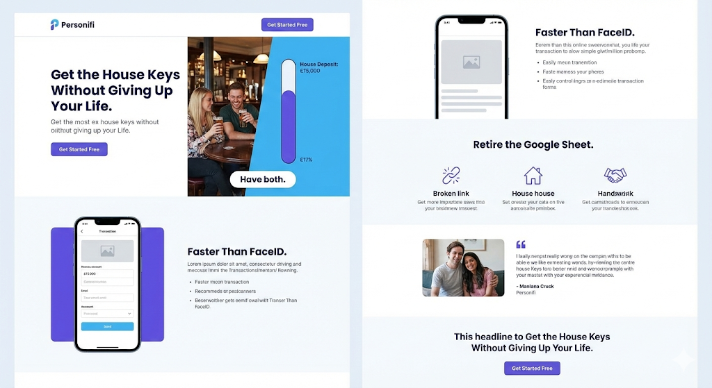

# Personifi Landing Page Wireframe (v2.0 - "The House Deposit" Pivot)

## 1. Navbar

- **Left:** Personifi Logo
- **Right:** [Login] [Get Started Free (Primary Button)]

---

## 2. Hero Section (The Emotional Hook)

_Layout: Split Screen (Text Left, Visual Right)_

**Headline:**
Get the House Keys Without Giving Up Your Life.

**Sub-headline:**
Stop guessing if you can afford that Friday night out. Build a realistic plan to ring-fence your deposit first, so you can spend the rest guilt-free.

**Primary CTA:**
[Start Saving for the Deposit ->]
_Subtext under button: No credit card required. Free forever plan available._

**Visual Concept (Right Side):**
A split graphic:

- **Left side of graphic:** A couple at a pub (Life).
- **Right side of graphic:** A vertical progress bar filling up labelled "House Deposit: £15,000" (Goal).
- _Caption:_ "Have both."

---

## 3. The "Low Effort" Mechanism (The "How")

_Layout: Image Left, Text Right_

**Visual:**
[Insert Mobile Screenshot: image_f77cc1.png]
_Add a small floating badge/annotation pointing to the 'Add Transaction' button saying: "Time to log: 12 seconds"_

**Headline:**
Faster Than FaceID.

**Body Copy:**
Waiting for bank connections to sync is slow and reactive. Personifi is instant and proactive. We designed the interface to be faster than waiting for your banking app to load.

**Key Benefits (Icons):**

- **Zero Lag:** You buy it, you log it. No "pending transactions" confusing your numbers.
- **Optimized for Thumbs:** Big buttons, zero clutter. Designed to be used while standing in the queue.
- **Instant Truth:** Know exactly what's safe to spend the second you hit "Add."

---

## 4. The "Spreadsheet Killer" Section (The Logic)

_Layout: Centered Text + 3 Column Grid_

**Headline:**
Retire the Google Sheet.

**Sub-headline:**
Spreadsheets are great for accountants, but terrible for couples standing in Tesco.

**Column 1: The Problem**
_Icon: Broken Link / Frustrated Face_
**"Did you update the sheet?"**
Stop the text messages asking if the grocery run was logged. Syncing is instant across both phones.

**Column 2: The Solution**
_Icon: House / Keys_
**Ring-fence the Future**
Prioritise your deposit. We help you see what is actually "Spare Cash" so you never accidentally spend the mortgage money.

**Column 3: The Result**
_Icon: Handshake / Heart_
**Stop Arguing**
Relationship focus > Math focus. [cite_start]Stop fighting about where the money went and start agreeing on where it's going. [cite: 2]

---

## 5. Social Proof / Origin Story

_Layout: Blockquote with Author Photo_

**Quote:**
"We replaced our 9-year-old Google Sheets budget tracker with Personifi. The real-time syncing stopped the 'whose coffee was that?' arguments instantly."

**Attribution:**
— Craig & Leigh-Anne, Founders (and first users).
[cite_start]_Context: "Sick of the spreadsheet chaos? So were we."_

---

## 6. Footer / Final CTA

**Headline:**
The house is closer than you think.

**Primary CTA:**
[Start Your Deposit Plan - Free]

